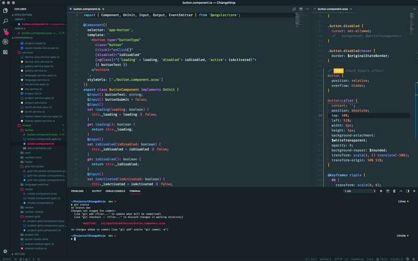

# Module 3 Solutions

<!-- TOC -->

- [Module 3 Solutions](#module-3-solutions)
    - [04 - Building Off-canvas menu](#04---building-off-canvas-menu)
    - [05 - Building a modal](#05---building-a-modal)
    - [07 - Debugging errors](#07---debugging-errors)
    - [08 - Using a linter](#08---using-a-linter)
        - [Extensions:](#extensions)
        - [Custom editor settings](#custom-editor-settings)

<!-- /TOC -->

[Back to Module 2](../Module2/solutions.md)

[On to Module 4](../Module4/solutions.md)

## 04 - Building Off-canvas menu

1. Step 1 - determine the css

```css
/* We need to slide both the site-container and offsite-container to the right. so the easiest way is to add the class that indicates the button to open the menu was clicked is to add it on the body tag so that both the site-container and offsite-container can see that the parent says open */
.offsite-is-open .site-container,
.offsite-is-open .offsite-container {
	transform: translateX(14rem);
}
```

2. Step 2 - add the listener and logic

```js
// in your main.js
// Select the button by the class menu-button
const offsiteToggle = document.querySelector('.menu-button');

/* Add the click listener to the button. Select the body tag and toggle the new offsite-is-open class that changes the position of the two containers
*/
offsiteToggle.addEventListener('click', () => {
	const bodyClassList = document.body.classList;
	const toggleClass = 'offsite-is-open';
	bodyClassList.toggle(toggleClass);
});
```

[Back to top](#Module-3-Solutions)

## 05 - Building a modal

I don't feel like re-building the basic version of this, so if you want to PR your version of it, please do. The completed and animated version will be later on in the course solutions.

[Back to top](#Module-3-Solutions)

## 07 - Debugging errors

***Are there any errors with the following code? If yes, find out what they are and fix them.***

```html
<a class="button" href="#">Link that looks like a button</a>
```

```js
const button = document.querySelector('button')

button.addEventListener('click' e => {
  console.log('Button clicked!'))
})
```

Several issues here.
1. `querySelector` is looking for a button tag not the class.

```js
const button = document.querySelector('.button')
```

2. Next is a syntax error on the eventListener. A `,` is required to separate the event name and the function. Also there is an extra parenthesis at the end of the console.log. Optionally, the curly braces are not necessary, but also not a syntax error.

```js
button.addEventListener('click', e => 
  console.log('Button clicked!')
)
```
[Back to top](#Module-3-Solutions)

## 08 - Using a linter

***Get yourself a bit more comfortable with seeing red squiggly lines :)***
```json
"squigglies": "~~~~~~~~~~~~~~~~~~~~~~~~~~~~~~~~~"
```

I'll take this portion as an opportunity to share with you my VS Code setup. I use it for web development in JavaScript, TypeScript, Angular, React, and React Native.


[Screenshot](https://www.github/chiangs/jsf-solutions2/Module3/screenshot.png)

### Extensions:
1. **Settings Sync** - can upload your editor settings to git to sync to other instances of VS Code (e.g., home vs work).
2. **Prettier** - formats code
3. **Path Intellisense** - makes importing and finding paths so much easier and faster
4. **Markdown All in One** - everything you need to write in markdown
5. **JS and TS Intellisense** - more intellisense
6. **CSS Intellisense** - for class names
7. **SASS** - Syntax highlighting etc.
8. **SCSS Intellisense** - super useful for SCSS (SASS) variables.
9. **TSLint** - linting for TypeScript
10. **Guides** - see more guide lines, helps with tall code blocks
11. **Color Picker** - quickly pick and change color codes in hex and rgb
12. **Bracket Pair Colorizer** - easily pick out which bracket belongs to which, helps with nested blocks
13. **Auto rename tag** - if you want to change an html tag, this fixes the end tag as you change the beginning tag
14. **Angular Language Service**
15. **Angular2-inline** - helps with syntax highlighting for inline templates, not perfect though, some issues with [ngClass] conditions
16. **Angular 6 Snippets**
17. **Advanced new file** - quickly make files and directories, could just do it in the console with mkdir, and touch though.
18. **TODO Highlight** - highlights any comment followed by TODO: or FIXME: to easily find and remember to actually DO or FIX.
19. **WakaTime** - sends you a weekly report of time spent on different projects with github repos.

### Custom editor settings
Get to know emmet. It's worth it. also, the font I'm using is free, but requires installation from their github repo, also worth it. Another good monospace font is Source Code Pro, available on Google Fonts.

If you are wondering about my console, it is using zsh.
```json
{
	"[markdown]": {
		"editor.formatOnSave": false
	},
	// "editor.fontFamily": "Source Code Pro",
	"editor.fontFamily": "Fira Code",
	"editor.fontLigatures": true,
	"editor.fontSize": 16,
	"editor.formatOnPaste": true,
	"editor.formatOnSave": true,
	"editor.formatOnType": true,
	"editor.renderIndentGuides": false,
	"editor.snippetSuggestions": "top",
	"editor.wordWrap": "on",
	"emmet.includeLanguages": {
		"javascript": "javascriptreact"
	},
	"emmet.showSuggestionsAsSnippets": true,
	"emmet.triggerExpansionOnTab": true,
	"html.format.wrapLineLength": 0,
	"html.suggest.angular1": false,
	"materialTheme.autoApplyIcons": true,
	"materialTheme.fixIconsRunning": false,
	"prettier.eslintIntegration": true,
	"prettier.jsxBracketSameLine": true,
	"prettier.singleQuote": true,
	"prettier.tabWidth": 4,
	"prettier.useTabs": true,
	"sync.askGistName": true,
	"sync.autoDownload": false,
	"sync.autoUpload": false,
	"sync.forceDownload": false,
	"sync.gist": "gistNumberNot4U2C",
	"sync.host": "",
	"sync.lastDownload": "",
	"sync.lastUpload": "2018-07-17T19:45:52.868Z",
	"sync.pathPrefix": "",
	"sync.quietSync": false,
	"sync.removeExtensions": false,
	"sync.syncExtensions": true,
	"terminal.external.osxExec": "iTerm.app",
	"terminal.integrated.copyOnSelection": true,
	"terminal.integrated.scrollback": 2000,
	"typescript.format.insertSpaceAfterOpeningAndBeforeClosingNonemptyParenthesis": true,
	"typescript.format.insertSpaceAfterOpeningAndBeforeClosingTemplateStringBraces": true,
	"typescript.format.insertSpaceAfterTypeAssertion": true,
	"typescript.format.insertSpaceBeforeFunctionParenthesis": true,
	"window.restoreFullscreen": true,
	"window.zoomLevel": -1,
	"workbench.activityBar.visible": true,
	"workbench.colorCustomizations": {
		"editor.findWidgetResizeBorder": "#FFA000",
		"activityBarBadge.background": "#FF4081",
		"list.activeSelectionForeground": "#FF4081",
		"list.inactiveSelectionForeground": "#FF4081",
		"list.highlightForeground": "#FF4081",
		"scrollbarSlider.activeBackground": "#FF408150",
		"editorSuggestWidget.highlightForeground": "#FF4081",
		"textLink.foreground": "#FF4081",
		"progressBar.background": "#FF4081",
		"pickerGroup.foreground": "#FF4081",
		"tab.activeBorder": "#FF4081",
		"notificationLink.foreground": "#FF4081",
		"editorWidget.resizeBorder": "#FF4081",
		"editorWidget.border": "#FF4081",
		"settings.modifiedItemForeground": "#FF4081",
		"panelTitle.activeBorder": "#FF4081"
	},
	"workbench.iconTheme": "eq-material-theme-icons",
	"workbench.startupEditor": "none",
	"workbench.statusBar.visible": true,
	"zenMode.hideTabs": false,
	"zenMode.restore": true,
	"material-icon-theme.hidesExplorerArrows": true,
	"editor.cursorBlinking": "smooth",
	"workbench.colorTheme": "Material Theme High Contrast",
	"materialTheme.accentPrevious": "",
	"materialTheme.accent": "Pink",
	"typescript.updateImportsOnFileMove.enabled": "always",
	"markdown-toc.updateOnSave": true,
}
```

[Back to top](#Module-3-Solutions)

[On to Module 4](../Module4/solutions.md)